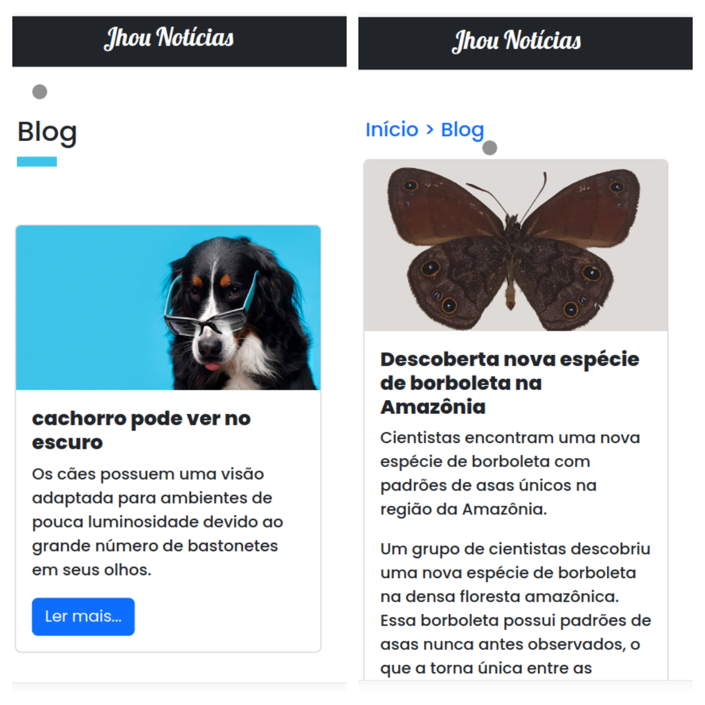

# Teste Maximize - Feed-Notícias



O desafio proposto é desenvolver a entrega de um feed de notícias para uma
aplicação com o uso de API, utilizando ferramentas open-source.

### Pré-requisitos

- Docker
- Git
- Pacote Make

## Instalação

1. Clone o repositório do projeto Feed-Notícias do GitHub:

```sh
git clone git@github.com:Jhousef/desafio-feed-noticias.git
cd desafio-feed-noticias.git
```

2. Crie a rede docker que será utilizada pelo ambiente:

```sh
docker network create laravel
```

### No linux

3. Utilizaremos o make para facilitar nossa vida, caso não tenha o make instalado faça:

```sh
sudo apt install make
```

4. Agora iremos rodar o comando make para subir o ambiente:

```sh
make start
```

5. Após aguardar a criação do ambiente nosso app estará disponível nos seguintes endereços:

- frontend: [localhost:3005](http://localhost:3005)
- backend: [localhost:8000](http://localhost:8000)

### No Windows

No windows para subir o ambiente rode os seguintes comandos

```sh
docker-compose up --build -d
docker-compose exec -it app cp .env.example .env
docker-compose exec -it app composer install
docker-compose exec -it app php artisan migrate
docker-compose exec -it app php artisan db:seed
docker-compose exec -it app chmod 777 -R bootstrap/cache storage
```
